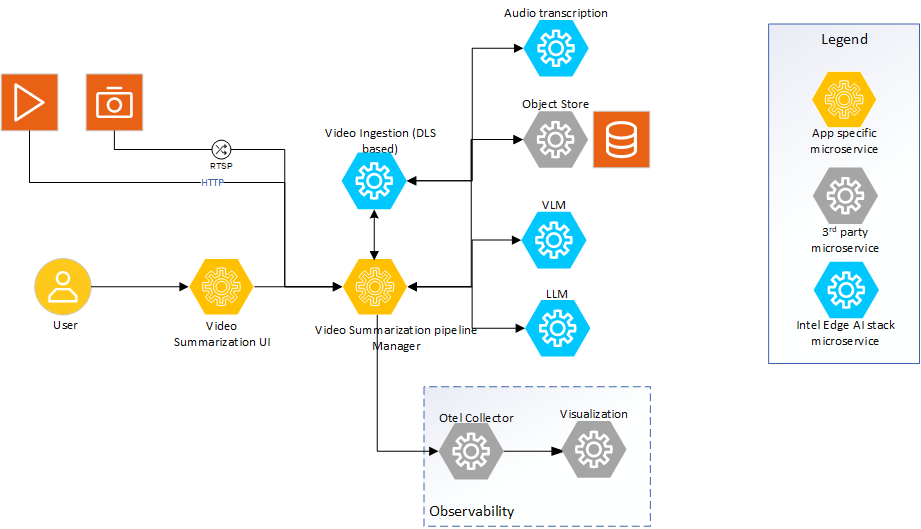
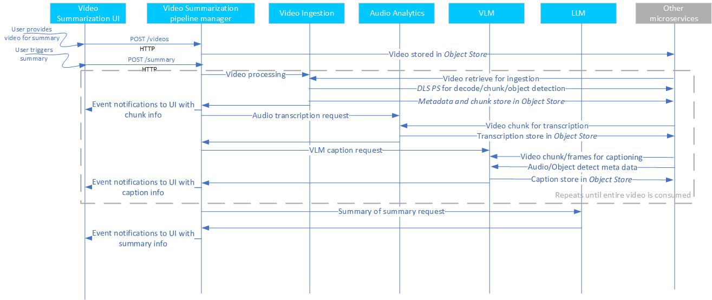

# Video Summary Architecture Overview

The Video Summary pipeline allows developers to deploy video summary capability in an on-prem environment and feed on the private video. The application is built on a modular microservices approach and is intended to be scalable and customizable across multiple industry segment-specific deployments. This page provides a technical overview of the application’s architecture, components, and extensibility.

## Architecture
The system architecture diagram shows the Video Summary pipeline and its constituent components. The following is a high-level overview of the components.

1. **Video Summarization UI**: A reference UI is provided for the users to interact with and exercise all capabilities of the video summary application. 

2. **Video Summarization pipeline manager**: The pipeline manager is the central orchestrator of the summary pipeline. It receives the requests from the UI and uses the other set of microservices to deliver the summary capability. It provides for asynchronous handling of the video.

3. **Video Ingestion**: This microservice is responsible for ingesting videos that need to be summarized. The ingestion microservice is based on DLStreamer pipeline server to manage the video pipeline. The video ingestion microservice allows ingestion of common video formats. The ingestion microservice creates video chunks, extracts configured frames from them, passes the frame(s) through object detection and outputs all of the metadata and the video chunks to the object store.

4. **VLM as the captioning block**: The VLM microservice is responsible for generating captions for the specific video chunk. The VLM accepts prompts that also include additional information from configured capabilities (like object detection) and generates the caption. The caption information is stored to the object store.

5. **LLM as the summarizer of captions**: The LLM microservice generates the summary of the individual captions. You can also use the LLM to summarize at a chunk level (captions of individual frames of the chunk), but it is optional.

6. **Audio transcription**: The Audio transcription microservice helps create a transcription of the audio channel in the given video. The extracted audio transcription serves as another source of rich metadata that can be used both as an input to VLM and separately as text data to enrich the summary.

More details on the system architecture and customizable options are available [here](./overview-architecture-summary.md).

## Detailed Architecture Overview
<!--
**User Stories Addressed**:
- **US-7: Understanding the Architecture**
  - **As a developer**, I want to understand the architecture and components of the application, so that I can identify customization or integration points.

**Acceptance Criteria**:
1. An architectural diagram with labeled components.
2. Descriptions of each component and their roles.
3. How components interact and support extensibility.
-->

Video Summary application is a customizable pipeline that provides varied capabilities to meet different deployment requirements. The capabilities ensure a rich contextual and perceptual analysis of video during the summary process thereby providing qualitatively richer summary of the given video. The following figures illustrates the setup. The Video Summary UI communicates with the Video summary pipeline manager microservice to feed the video to be summarized and provide continuous update through the summary process. The UI allows the you to configure the specific capabilities required in the summary pipeline as in the examples shown in figure 1. The pipeline manager is responsible for managing the user requests and dynamically configure a functional pipeline corresponding to the user request.

The VLM, LLM, and Embedding microservices are provided as part of Intel Edge AI inference microservices catalog supporting a rich set of open-source models that can be downloaded from popular model hubs like [Hugging Face OpenVINO](https://huggingface.co/OpenVINO). The video ingestion microservice provides capability to ingest common video formats, chunk the video, feed the extracted frames to configurable capabilities like object detection, and provide the output of it to the VLM microservice for captioning. The individual captions are then summarized at the end by the LLM microservice to provide the final summary of the video. The audio transcription microservice provides ability to transcribe the audio using Whisper model. An object store is used to save the raw videos, frames, and generated metadata.

### Architecture Diagram

*Figure 2: Architecture of video summary sample application

### Application Flow
The application flow involves the following steps:

1. **Create the video summary pipeline**
   - **Configure the pipeline**: The _video summarization UI microservice_ provides the user a means to configure the different capabilities required on the summary pipeline. A separate user guide is planned to provide all required details on how to setup the pipeline.
   - **Create the pipeline**: The configuration done on the UI is received by the _Video summarization pipeline manager microservice_. The pipeline manager configures the required microservices as per the capabilities and configuration requested by the user.    
2. **Input Video Sources**:
   - **Provide video**: The user provides the source of the video to be summarized. The UI provides means to configure the input video. Currently, only offline video processing is supported by reading from local storage. In future, live camera streaming support will also be provided. The pipeline manager stores the video into a local object store.
   - **Ingest video**: The stored video is then consumed by the _video ingestion microservice_. The video ingestion microservice reuses DL Streamer pipeline server and all its capabilities to provide for different features like object detection, audio classification, and (in future) input feed from live cameras. The ingestion process involves decode, chunking, and selection of frame(s) from the input video. The extracted frame(s) is passed through object detection blocks, audio classification block if they are configured. The extracted frames along with the metadata returned by the object detector and/or audio classification is then passed to the VLM microservice.
   - **Audio transcription**: The video is demuxed and audio extracted for transcription. Using the object store, the audio is fed to the _Audio transcription microservice_ and transcription is created. This transcription is used to feed to the caption part of process as well as stored in the object store for latter stage processing.
3. **Create Caption for given frame(s)**
   - **VLM microservice**: The extracted frame(s) along with the prompt and metadata returned from the object detector and/or audio classification is passed to the _vlm-ov-serving_ for captioning. Depending on the configuration and compute availability, batch captioning is also supported. To optimize for performance, the captioning is done in parallel with the video ingestion.
   - **VLM model selection**: The capability of the VLM microservice is dependent on the VLM model used. Example, multi-frame caption by maintaining a context between frames is a function of the chosen model. In addition, the prompt passed has a significant implication on the quality of the output of the VLM.
   - **Store the captions**: The generated captions along with all the metadata generated in the pipeline is stored in a local object store. During store, necessary relationship information between the stored data is also maintained.
4. **Create summary of all captions**:
   - **LLM microservice**: After all the captions are summarized, the _LLM microservice_ is used to create a summary of all individual captions. The selection of LLM model has an impact on the accuracy of the summary created.
5. **Observability dashboard**: 
   - If set up, the dashboard displays real-time logs, metrics, and traces providing a view of the performance, accuracy, and resource consumption by the application..   

The application flow is illustrated in the following flow diagram. The diagram shows the API used and the data sharing protocol.

*Figure 3: Dataflow for Video Summary sample application

## Key Components and Their Roles
<!--
**Guidelines**:
- Provide a short description for each major component.
- Explain how it contributes to the application and its benefits.
-->
The key components of Video Summary are as follows:

1. **Intel Edge AI Inference microservices**:
   - **What it is**: Inference microservices are the VLM, LLM, and Audio transcription microservices that run the chosen models optimally on the hardware. 
   - **How it's used**: Each of the microservices uses OpenAI APIs to support their functionality. The microservices are configured to use the required models and launched. The video pipeline manager  accesses these microservices using the APIs.
   - **Benefits**: The default configuration of these microservices as provided by the sample application is guaranteed to perform optimally for the chosen models and on the target deployment hardware. Standard OpenAI API ensures easy portability of different inference microservices.

2. **Video ingestion microservice**:
   - **What it is**: Video ingestion microservice, which reuses DL Streamer pipeline server, provides capability to ingest videos, extract audio, create chunks, provides object detection and audio classification capabilities, and feed all the extracted raw information and generated metadata to the next stage of processing.
   - **How it's used**: Video ingestion microservice provides a REST API endpoint that can be used to manage the contents. The Video pipeline manager uses this API to access its capabilities.
   - **Benefits**: DLStreamer pipeline server is a standard Intel offering which is optimized for various media and vision analytics based inference tasks. Refer to DLStreamer pipeline server documentation for details on its capabilities.

3. **Video Summary Pipeline manager microservice**:
   - **What it is**: This microservice is the heart of the video summary sample application as it orchestrates the pipeline as per user configuration. The pipeline manager uses a message bus to coordinate across different microservices and also provides performance motivated capabilities like batching and parallel handling of multiple operations.
   - **How it’s used**: A REST API endpoint is provided which is used by the UI front end to send user queries and trigger the summary pipeline.
   - **Benefits**: The microservice provides a reference of how the different microservices have to be orchestrated for video summary pipeline.

4. **Video Summarization UI microservices**:
   - **What it is**: The UI microservice allows the user to interact with the sample application. It allows the user to configure the capabilities required on summary pipeline, configure the input video details, and trigger the summary pipeline.
   - **How it’s used**: UI interface should be used by the user to interact with this microservice.
   - **Benefits**: This microservice should be treated as a sample reference implementation.

5. **Dependent microservices**:
   The dependent microservices are those that are used by the pipeline to realize the features. Few of them are inference microservices while the others are data handling microservices. These microservices belong to either (1) or (2) listed above. The dependent microservices are: 
   - [Multimodal Embedding](../../../../microservices/multimodal-embedding-serving/)
   - [Audio Analyzer](../../../../microservices/audio-analyzer/)
   - [VDMS based data preparation](../../../../microservices/visual-data-preparation-for-retrieval/vdms/) 
   - [VLM microservice](../../../../microservices/vlm-openvino-serving/). 
   
   Refer to their respective documentation for details on their capability. 

## Extensibility

The video summary sample application is designed with modularity in mind, allowing you to:
1. **Change inference microservices**:
   - The default option is OVMS. Use other model servers like vLLM with OpenVINO backend, and TGI to host VLM models.
   - Mandatory requirement is OpenAI API compliance. Note that other model servers do not provide the same performance as default options. 
2. **Load different VLM and LLM models**:
   - Use different models from Hugging Face OpenVINO model hub or vLLM model hub. The models are passed as a parameter to corresponding model servers.
3. **Configure different capabilities on the summary pipeline**: 
   - In addition to available capabilities, the approach also allows newer capabilities to be enabled if it helps on the accuracy.
   - The UI, pipeline manager, and required microservices are easily configurable to allow for such extensions.
4. **Deploy on diverse Intel target hardware and deployment scenarios**:
   - Follow the system requirements guidelines on the different options available.

## Next Steps
- [Get Started](./get-started.md)
